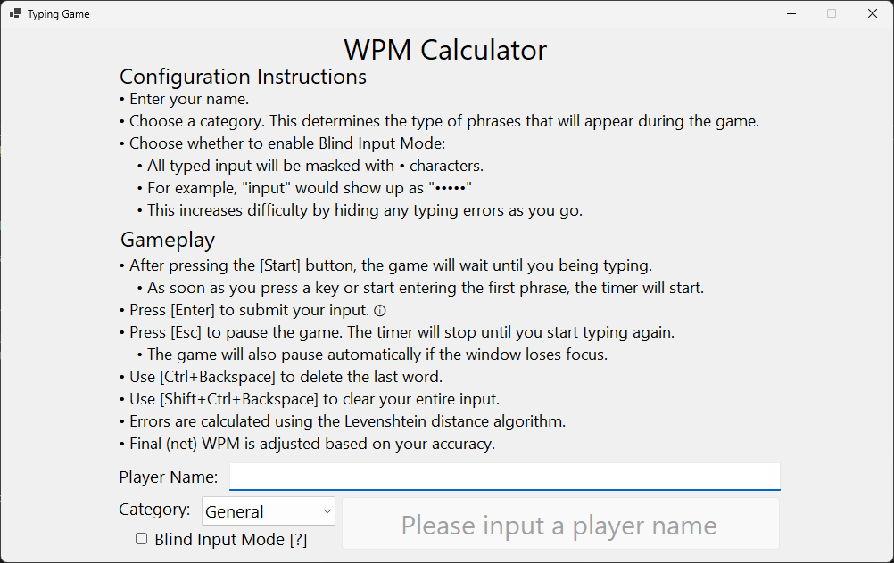
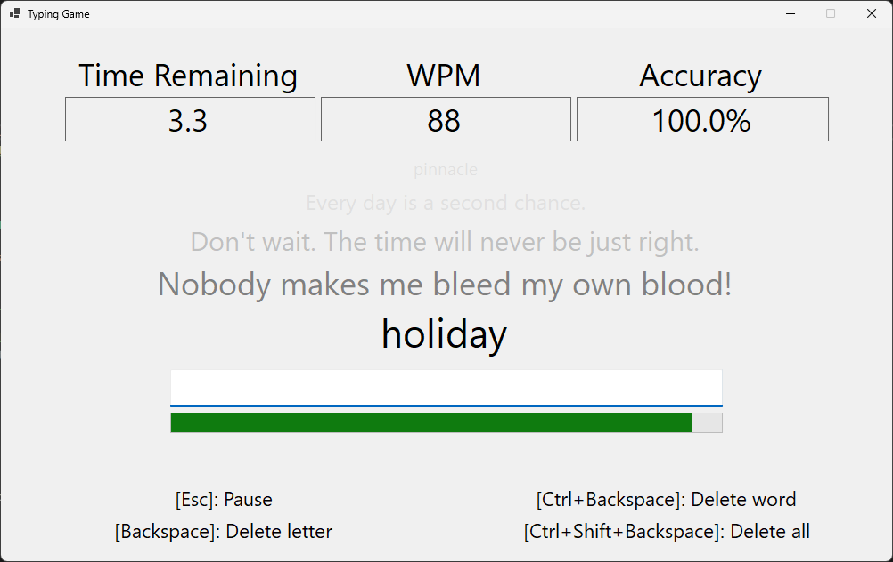
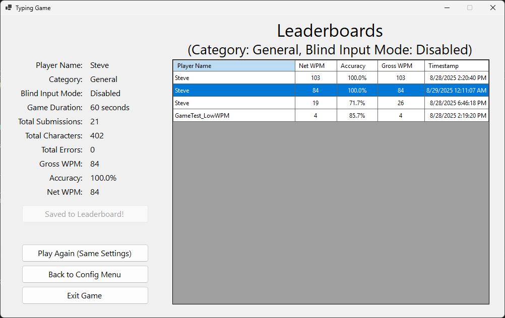

# Typing Game

A fast-paced typing challenge built in **C# with WinForms**.  
This project was created in 2025 as a way to practice **object-oriented programming, event-driven design, and UI development**.

---

## How the Game Works
- Select your **Player Name**, **Category** (*General*, *C#*, *Single Words*), and whether to enable **Blind Input Mode** (hides typed text).  
- The game runs for **60 seconds** by default.  
- A row of 5 words/phrases is displayed; the bottom (biggest) one is the current target.  
- Type the word/phrase and press **Enter** to submit.  
- Each submission updates:
  - **Gross WPM** (speed including Enter key submissions).  
  - **Accuracy %** (measured with Levenshtein distance).  
- When time runs out, the game ends and calculates **Net WPM**, which accounts for both speed and accuracy.  
- The **Results Screen** displays your performance and allows saving to the appropriate leaderboard.  

---

## WPM Formula Change
Unlike most typing tests, this game treats **Enter submissions as characters** when calculating WPM.  
- This is because Enter replaces the spacebar’s role in paragraph-style tests.  
- Gross WPM and Accuracy are updated live during gameplay.  
- Net WPM is calculated only at the end of the run using total characters, errors, and submissions.  

---

## Features
- **Dynamic Categories** – Supports *General*, *C#*, and *Single Words*. New phrase lists can be added easily.  
- **Leaderboard System** – Results are stored locally in JSON files. Each category maintains two leaderboards: one for **Blind Input Mode enabled** and one with it disabled. Entries are sorted by **Net WPM → Accuracy → Gross WPM → Timestamp**.  
- **Blind Input Mode** – Optional challenge mode that hides typed text.  
- **Refined Controls**:
  - `Enter` → Submit word/phrase.  
  - `Escape` → Pause/resume.  
  - `Ctrl+Shift+Backspace` → Custom keyboard shortcut to clear input box.
- **Player Name Required** – Prevents empty leaderboard entries.  

---

## Current Limitations
- Single mode: WPM Calculator
- Only **60-second runs** are supported (duration is fixed); I'm undecided on whether to allow other durations.  
- **Leaderboards are offline-only** (JSON-based, no online ranking).  
- UI is functional but minimal, with limited styling.   

---

## Future Improvements
- Possible **multiplayer racing mode** (long-term goal): online PVP-style WPM calculator.
- Posisble **time attack mode**: Errors will reduce time slightly, submissions will increase it slightly.
- **Online leaderboards**, potentially hosted on **Azure** or backed by an SQL database.  
- Migration to a **Blazor web app**.  
- Possible **“Story” category**, where players type through passages from open-source or preloaded AI-generated stories.  
- Clearer **separation of concerns**, introducing an **MVVM or MVC pattern** (depending on Blazor direction).  
- **Dependency Injection** for cleaner, testable architecture when migrating to the web app.  

---

## Lessons Learned
This project helped me apply a wide range of software development skills:  
- Applying **clear separation of concerns** between UI and game logic, though there are still a few areas that could be improved.  
- Applying **object-oriented game design** principles.  
- Saving/loading leaderboard **timestamps in UTC** and converting them to the player’s local timezone for display.  
- Creating and using **custom events** (`ExitToConfigMenuRequested`, `PlayAgainRequested`) to handle screen transitions in the `ScreenManager`.  
- Implementing JSON persistence, LINQ sorting, and custom input handling for better UX.  

---

## Screenshots
### Configuration Screen

### Gameplay Screen

### Results Screen

---

## Contributing
This is a personal learning project, but feedback and suggestions are welcome!  
