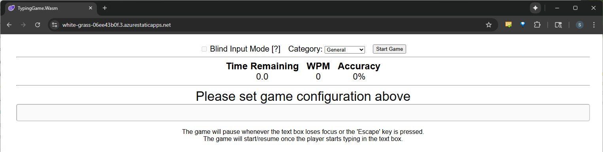
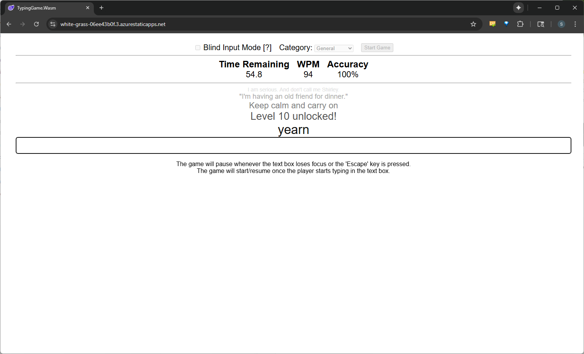
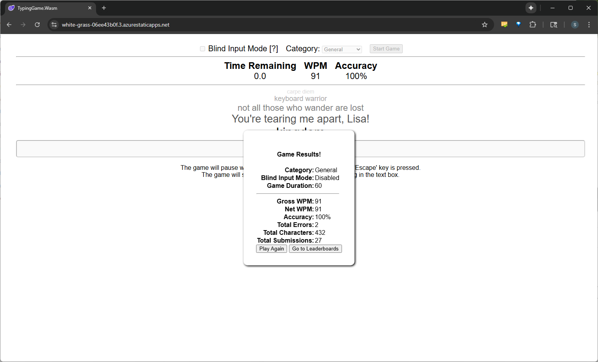
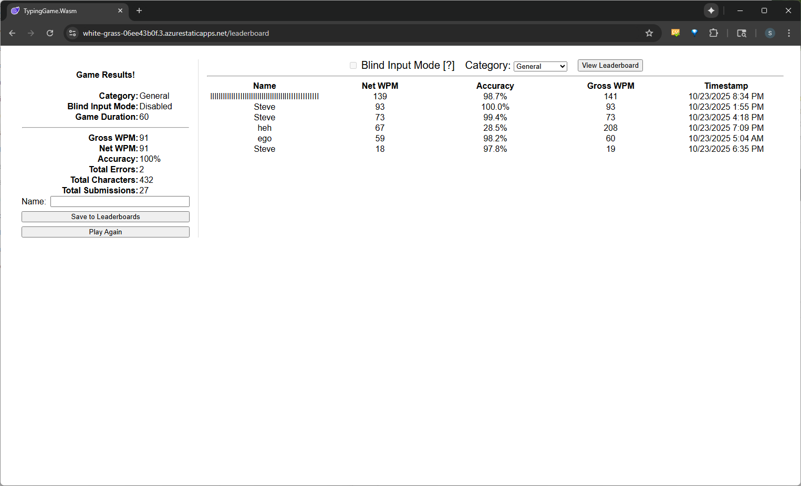

# Typing Game (Blazor + Azure)

A browser-based typing practice game rewritten in **Blazor WebAssembly (.NET 9)** and deployed to **Azure Static Web Apps** with an **Azure Functions** API and **Cosmos DB (NoSQL)**–backed leaderboards.

**Live site:** \<temporarily down>

---

## How the Game Works

- Pick your player name and a **Category** (e.g., General, C#, Single Words).  
- A 60-second round shows a vertical stack of five phrases; the **largest (bottom) item** is the current target to type.  
- Type the current target and press **Enter** to submit.  
- The HUD updates **Gross WPM** and **Accuracy** during play; when time expires, **Net WPM** (speed adjusted by accuracy) is computed and shown on the results screen—where **you can submit your name and publish your score** to the cloud leaderboard.

---

## WPM Formula Change
Unlike most typing tests, this game treats **Enter submissions as characters** when calculating WPM.  
- This is because Enter replaces the spacebar’s role in paragraph-style tests.  
- Gross WPM and Accuracy are updated live during gameplay.  
- Net WPM is calculated only at the end of the run using total characters, errors, and submissions.  

---

## Features

- **Dynamic Categories** – Supports *General*, *C#*, and *Single Words*. New phrase lists can be added easily.
- **Leaderboard System** – Results are stored in a CosmosDB for NoSQL database. Each category maintains two leaderboards: one for **Blind Input Mode enabled** and one with it disabled. Entries are sorted by **Net WPM → Accuracy → Gross WPM → Timestamp**.    
- **Single-player mode** (parity with WinForms core gameplay)  
- **Cloud leaderboards** via Azure **Cosmos DB**  
- **Enum-driven categories**  
- **Metrics:** Gross/Net WPM, Accuracy, Timestamp  
- **Deployed** as Azure **Static Web App** with **Functions API** (`api/LeaderboardsAPI`)

---

## Current Limitations

- **Blind Input Mode** not yet implemented in the Blazor version  
- Single-player only  
- 60-second fixed duration  
- UI is intentionally minimal (baseline styling)

---

## Leaderboards (API + Data)

- **Endpoint:** `api/LeaderboardsAPI` (Azure Functions, .NET 9 isolated)  
- **Storage:** Cosmos DB container (id, category, name, net/gross WPM, accuracy, timestamp)  
- **Notes:** Input validation and normalization on server; typed client (`LeaderboardsApiClient`) via DI `HttpClient`.

---

## Project layout

```
/TypingGame
├─ .github/workflows         # CI/CD (SWA / Functions)
├─ legacy-winforms           # Original WinForms app (local JSON leaderboard)
└─ src
   ├─ TypingGame.Core        # Game engine, metrics, DTOs, services
   ├─ TypingGame.Wasm        # Blazor WebAssembly client
   └─ api                    # Azure Functions API (LeaderboardsAPI)
```

---

## Tech stack

- **Client:** Blazor WASM (.NET 9), DI, light ViewModels (MVVM-ish)  
- **Server:** Azure Functions (.NET 9 isolated)  
- **Data:** Azure Cosmos DB (NoSQL)  
- **Cloud:** Azure Static Web Apps
- **CI/CD:** GitHub Actions auto-deploys to Azure preview environment **on pull requests** and to production site **on merges to master** (SWA+Functions)

---

## What’s new vs. legacy WinForms

**Architecture & Patterns**
- **Separation of concerns:** Core engine + thin UI + separate API  
- **MVVM-ish UI:** page-level ViewModels keep components simple and testable  
- **Contracts:** DTOs (`GameSummaryDTO`, `GameConfig`) and interfaces (`IGameEngine`, `IPhraseService`)

**Runtime & Performance**
- **Async I/O** replaces synchronous local file writes  
- **Lean UI thread:** HUD/input on client; persistence/validation via API

**Reliability & Ops**
- **Online leaderboards** (Cosmos) vs local JSON  
- **Azure SWA + Functions** with **clean CI/CD via GitHub Actions** for automatic deployments on PRs and merges

**Security**
- **Input sanitization** on client and API  
- **CORS & environment config** rather than hard-coded endpoints
- Possible time attack mode: Errors will reduce time slightly, submissions will increase it slightly.
- Possible multiplayer racing mode (long-term goal): online PVP-style WPM calculator.

---

## Future Improvements

- **Blind Input Mode** (feature parity with WinForms)  
- **Frontend polish:** improved layout, spacing/typography, dark mode, and smoother HUD animations  
- **Multiplayer (PVP)** using Blazor Server + SignalR  
- **Tighten MVVM:** promote page-level ViewModels and add unit tests for VMs/Core

---

## Lessons Learned

- Keep **UI and game logic separate**—Core + small ViewModels makes the UI easy to swap (WASM today, Server later).  
- **UTC everywhere** for timestamps; convert to local for display.  
- **Validate on both sides** (client + API) to prevent bad data and weird UI states.  
- **Events and state** flow cleanly when input + HUD updates stay client-side and persistence is async.
- **CI/CD with GitHub Actions** to automate build, test, and deploy to Azure Static Web Apps on pull requests and merges using repository secrets.
- **Cosmos DB partitioning** for leaderboards; use partition keys to separate leaderboards (e.g., by category) and keep queries efficient.
- **Azure Functions API integration**—a small .NET isolated Functions API with clear DTOs and status codes keeps client–server calls straightforward and reliable.
- **Azure hosting setup**—Static Web Apps front the Functions API, simplifying CORS; environment config lives in App Settings/Secrets, with Application Insights for diagnostics.

---

## Screenshots
### Gameplay Configuration

### During Gameplay

### Gameplay Results

### Leaderboards


---

## Dev notes

**Local dev (Visual Studio)**
- Run **TypingGame.Wasm** and the **Functions** project (`/src/api`) together.  
- Update ports below to match your environment.

**Client config (Blazor WASM)** – `wwwroot/appsettings.Development.json`
```json
{
  "ApiBaseUrl": "http://localhost:7071"
}
```

**Program.cs (clear HttpClient registration)**
```csharp
var apiBase = builder.Configuration["ApiBaseUrl"] 
              ?? builder.HostEnvironment.BaseAddress;

builder.Services.AddScoped(sp =>
{
    var baseUri = new Uri(apiBase);
    return new HttpClient { BaseAddress = new Uri(baseUri, "/") };
});

builder.Services.AddScoped<LeaderboardsApiClient>();
```

**Functions CORS** – `/src/api/local.settings.json`
```json
{
  "IsEncrypted": false,
  "Values": {
    "AzureWebJobsStorage": "UseDevelopmentStorage=true",
    "FUNCTIONS_WORKER_RUNTIME": "dotnet-isolated",
    "COSMOS_CONN_STR": "<your-cosmosDB-connection-string>",
    "COSMOS_DB_NAME": "<your-cosmosDB-name>",
    "COSMOS_CONTAINER_NAME": "<your-cosmosDB-container-name>"
  },
  "Host": {
    "CORS": "https://localhost:****,http://localhost:****",
    "CORSCredentials": true
  }
}
```

> On Azure SWA, you can omit `ApiBaseUrl` so the client uses the same origin as the built-in Functions.
